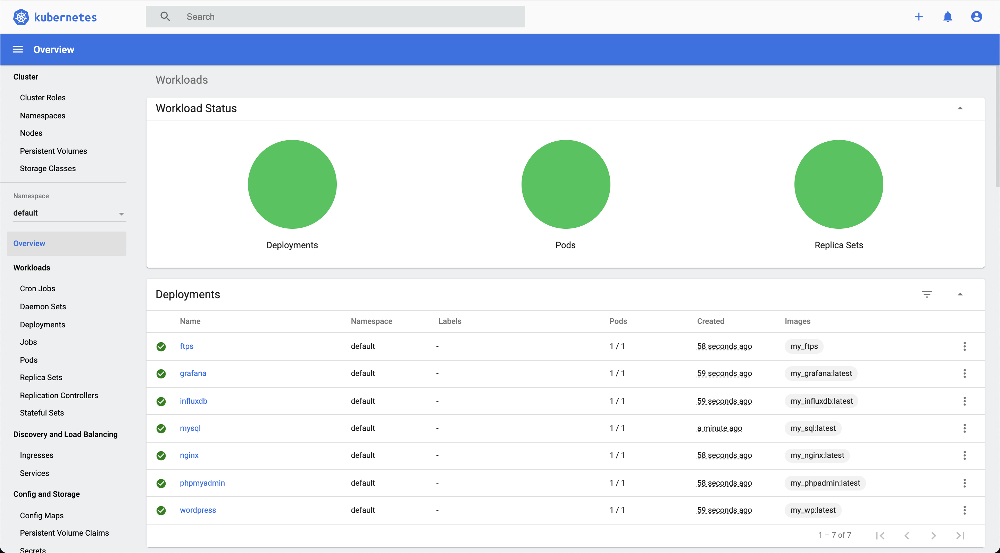

# ft_services

> 42's project, about creating a multi service Kubernetes Cluster.




## Built With

- Kubernetes
- Alpine Linux

## Live Demo

Only the home page, if you want to try all services go to [setup](#setup)

[Live Demo Link](https://franzudev.github.io/ft_services/)


## Getting Started

To get a local copy up and running follow these simple example steps.

### Prerequisites
- docker
- kubernetes
- kubectl
### <a name="setup"></a> Setup
Simply run:

```shell
sh setup.sh
```

### Usage
You can reach any service at:

- Homepage **[http/https]://localhost**
- Wordpress **https://localhost:5050**
  - user: franzu
  - pass: franzu
- Phpmyadmin **https://localhost:5000**
  - user: wordpress
  - pass: wordpress
- Grafana **http://localhost:3000**
  - user: admin
  - pass: admin
- FTPS **ftps://localhost:21**
  - user: franzu
  - pass: franzup

### Clean up
Simply run:

```shell
sh destroy.sh
```


## Authors

👤 **Author**

- GitHub: [@franzudev](https://github.com/franzudev)
- LinkedIn: [LinkedIn](https://www.linkedin.com/in/federico-françois)

## 🤝 Contributing

Contributions, issues, and feature requests are welcome!

Feel free to check the [issues page](../../issues/).

## Show your support

Give a ⭐️ if you like this project!

## 📝 License

This project is [MIT](./MIT.md) licensed.
